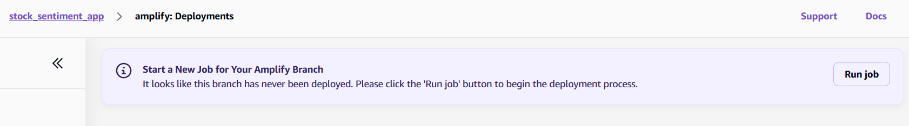

# sentiment-analysis-project

## Setup Instructions

### Requirements

- Use `us-east-2`
- AWS CLI (included on EC2 instances)
- Terraform CLI
- AWS root access keypair (for configuring the AWS CLI)
- EC2 keypair
- Git
- Node.js (for running the frontend locally via `npm`)
- Any web browser

### Notes

The fastest method to set up the project is using the AWS and terraform CLIs (installed on your local machine), then cloning the frontend locally and running it. 

*see Terraform (Local) and Frontend (Local)*

The project can also be set up completely using AWS and terraform, by spinning up an EC2 instance, copying & running the terraform files, then deploying the created amplify app using the AWS console.

*see Terraform (EC2) and Frontend (Amplify)*

### Terraform (EC2)

1. Create a new EC2 instance
2. Install terraform
	- Run `terraform init` to verify the installation
3. Configure AWS credentials via `aws configure`
	- You will need a root access key created from the account security options
	- Also make sure to specify `us-east-2` for the region when prompted
4. Upload project terraform files to an S3 bucket
	- Including the `lambda` AND `terraform` folders
5. Copy all uploaded files to the EC2 instance
6. Navigate to the directory containing the `main.tf` file
7. Create a `terraform.tfvars` file in the same directory and add your EC2 keypair
	- `key_pair = "YOUR_KEY_NAME_HERE"`
8. Run `terraform plan` to confirm you are in the correct location
9. Run `terraform apply` and type `yes` when prompted
10. Run `terraform destroy` and type `yes` when prompted to destroy the created resources

### Frontend (Amplify)

1. Open your AWS console after the terraform finishes executing (from previous setup)
2. Navigate to AWS Amplify
3. Click on the app titled `stock_sentiment_app`
4. Under 'branches', click on `amplify`
	- It should say 'no deploys' under the branch
5. Click 'run job' when prompted:

6. Wait for the frontend to build on amplify
	- This will take 7-10 minutes
7. After build has completed, navigate to the domain listed under the deployment
8. Interact with the app as desired

## Fallbacks

Alternative setup methods in case there are issues with running just the main branch terraform code via EC2 or deploying the frontend with amplify.

### Terraform (Local)

1. Install the AWS CLI and the terraform CLI
	- Run `terraform init` to verify the installation
2. Configure AWS credentials via `aws configure`
3. `cd` into the project terraform folder (where `main.tf` is located)
4. Create a `terraform.tfvars` file in the same directory and add your EC2 keypair
	- `key_pair = "YOUR_KEY_NAME_HERE"`
5. Run `terraform plan` to confirm you are in the correct location
6. Run `terraform apply` and type `yes` when prompted
7. Run `terraform destroy` and type `yes` when prompted to destroy the created resources

### Frontend (Local)

1. Clone the `amplify` branch locally
	- `git clone -b amplify git@github.com:Team-03-SWEN-514/sentiment-analysis-project.git amplify`
	- The above command will put the frontend code into a separate folder from the main terraform branch
2. Navigate to the cloned folder
	- Your terminal should be open to the same level as the `.gitignore` file
3. Run `npm install` to install required dependencies
4. After the terraform is finished executing (from previous setup instructions), create a `.env` file at the same level as the `.gitignore` file 
	- Insert the following line into the `.env` file and save:
	- `NEXT_PUBLIC_API_URL = "<api-gateway-url>"`
	- **Make sure the string `<api-gateway-url>` INCLUDING THE ANGLE BRACKETS is replaced with the output URL generated by running `terraform apply`**
5. Run `npm run dev` to run the frontend locally
6. Navigate to `https://localhost:3000` (or `http://localhost:3000`) to view the frontend
	- It may take a few moments to load while the page is initially compiled
7. Interact with the app as desired
